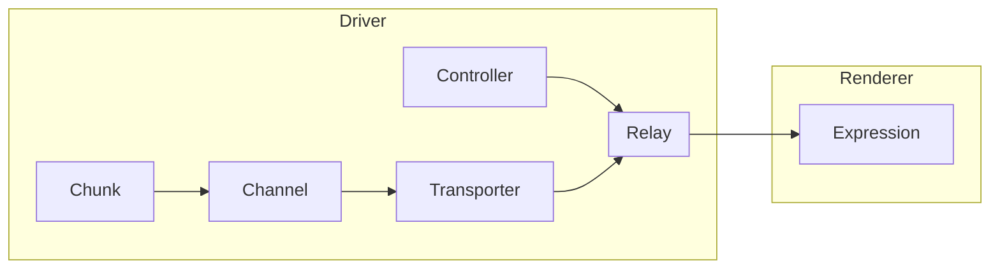

# ray

A protocol for amplifying capabilities. Look, hear, feel, taste, or smell your data. Express across senses — from any language to any system, in real time.



## Renderer

A renderer is a system that receives data and turns it into an experience. It may let people look, hear, feel, taste, or smell their data.

### Expression

An expression is a perceptual output generated by a renderer. A renderer may produce multiple expressions tuned to different senses.

## Driver

A driver is a system that creates and manages relays, controllers, and transporters. It sends structured commands and data to renderers. It defines what is sent and when, but not how it is perceived. A driver can be written in any language and used in any environment.

### Relay

A relay connects renderers, controllers, and transporters. It tracks connections and routes messages. It does not store data; that stays with controllers and transporters. It forwards commands and data to matching renderers. When a renderer requests synchronization, the relay forwards the request to the controller or transporter.

```clojure
{:connections {} :transporters {} :controllers {}}
```

#### Connection

A connection is a link between a remote renderer and a combination of a controller and a transporter. It transmits commands from the controller and data from the transporter and may provide synchronization of either.

```clojure
{:wire #AsyncChannel
 :identity {
   :controller "0196c01b-d769-7fdc-8c98-910d11b704b8"
   :transporter "0196c01b-d769-7a4d-89a6-9356ea2490af"}}
```

### Controller

A controller sends commands to define values for properties. It holds the current state—property/value pairs—which renderers can synchronize. It does not generate experiences or send data.

```clojure
{:id "0196c01b-d769-7fdc-8c98-910d11b704b8"
 :state {}}
```

### Transporter

A transporter sends data to renderers. It organizes data into channels and chunks. It holds the state of all data it has sent, so renderers can synchronize.

```clojure
{:id "0196c01b-d769-7a4d-89a6-9356ea2490af"
 :channels {}}
```

#### Channel

A channel is a named stream of data within a transporter. Each channel holds an ordered list of chunks. Channels allow a transporter to send different data streams in parallel. They are isolated, ordered, and replayable.

```clojure
{"A" [chunk chunk chunk]
 "B" [chunk chunk chunk]}
```

#### Chunk

A chunk is a unit of data within a channel. It has a unique ID, a _should_ statement, and data. Chunks are immutable and ordered, stored by the transporter, and sent in sequence. When a renderer synchronizes, the transporter replays all chunks in order.

_should_ can be: `append`, `concatenate`, `merge`, or `replace`.

```clojure
{:id "53e687e7-e9ec-4772-8c1e-fab729a022f9"
 :should "concatenate"
 :data [0xDE 0xAD 0xBE 0xEF]}
```

```clojure
{:id "58825405-014b-4c8a-afae-491feb1e01f6"
 :should "concatenate"
 :data [
  {:at "2025-05-17 10:16:06.386" :value 0.37}
  {:at "2025-05-17 10:16:06.386" :value 0.40}]}
```

```clojure
{:id "9e806926-5de7-48bf-805c-8d16eb811e9c"
 :should "append"
 :data {:at "2025-05-17 10:16:06.386" :value 0.37}}
```

```clojure
{:id "68bd7fad-9cbe-4c34-9a59-c67a1a4fcfaf"
 :should "replace"
 :data "Hello World"}
```

```clojure
{:id "9e806926-5de7-48bf-805c-8d16eb811e9c"
 :should "replace"
 :data 2.5}
```

```clojure
{:id "9e806926-5de7-48bf-805c-8d16eb811e9c"
 :should "merge"
 :data {:color "purple" :size 2.5}}
```
